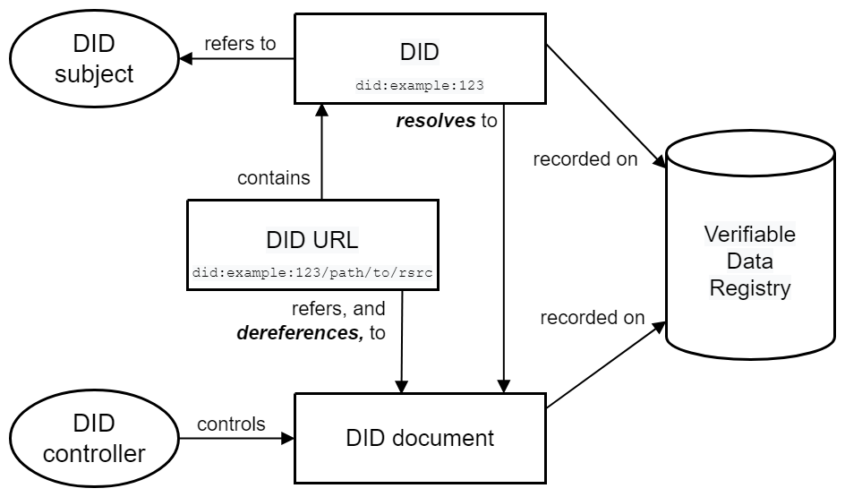

# Decentralized Self Sovereign Identity Decentralize Kit

The Decentralized Self Sovereign Identity Kit simplifies the process of managing and verifying users' identities digitally. It offers various functionalities to support decentralized identity management seamlessly.

## Features

### Creating DIDs (Decentralized Identifiers)

DIDs are unique identifiers for users, associated with their private keys, and entirely owned and governed by them. With this kit, users can create as many DIDs as they want, each representing separate profiles for their credentials.

### Issue VCs (Verifiable Credentials)

The kit allows users to issue verifiable credentials (VCs) to other users. These credentials contain attestation information and are cryptographically signed by the issuer, providing a secure and tamper-proof way to verify users' attributes and qualifications.

### Verify Credentials

Users can verify the authenticity and validity of credentials issued by others using this kit. By providing verification mechanisms, it ensures trust and reliability in the digital identity ecosystem.

## Getting Started

To get started with the Decentralized SSI Kit, follow these steps:

   **Install the Package**: Install the npm package `ssi-kit` in your project:

      ```
      npm install ssi-kit
      ```

With the Decentralized SSI Identity Kit, managing digital identities becomes easier, more secure, and decentralized. Start integrating it into your applications today for seamless identity management and verification!

